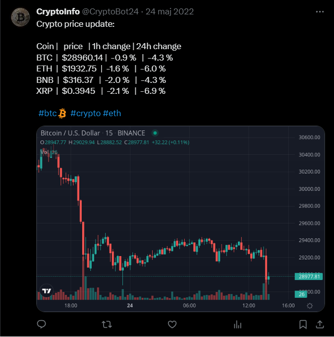
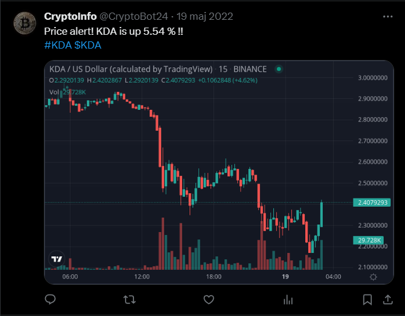
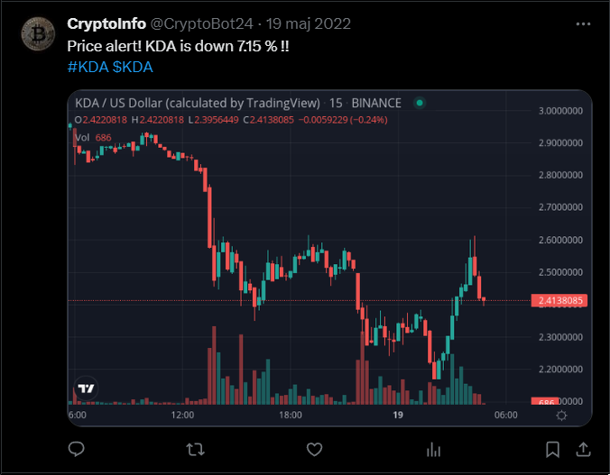
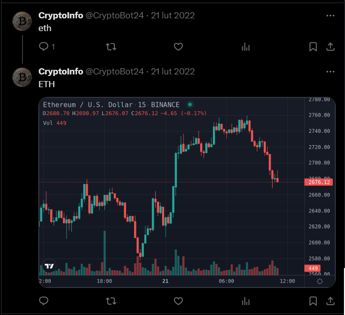

# CryptoBot24

This is a simple Twitter bot that:

- Posts crypto price updates from time to time.
- Checks for replies to its tweets with cryptocurrency symbols and responds with price charts for those symbols.
- Every ten minutes, snapshots the top 100 crypto prices and posts a price alert tweet if there is a significant change.

### APIs Used
- [CoinMarketCap](https://coinmarketcap.com)
- [Twitter](https://twitter.com)
- [Chart-Img](https://chart-img.com)

Deployed on Heroku.

You can see this bot in action [here](https://twitter.com/CryptoBot24).

**Note**: This project was created in 2022, and the APIs used might have changed since then.

### APIs and Libraries Used
- [CoinMarketCap](https://coinmarketcap.com)
- [Twitter](https://twitter.com)
- [Chart-Img](https://chart-img.com)
- [Pyrebase](https://github.com/thisbejim/Pyrebase) (to interact with Firebase for data storage)  

### Few Screenshots
Here are some screenshots demonstrating the bot in action:  
*Posting price updates*  

*Price alerts*  

*Price alerts*  

*Replying to replies with symbols*  

